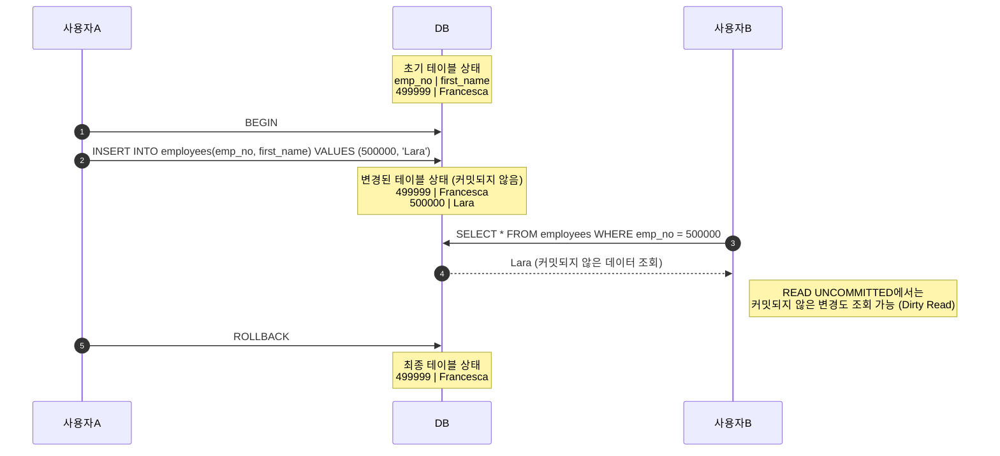
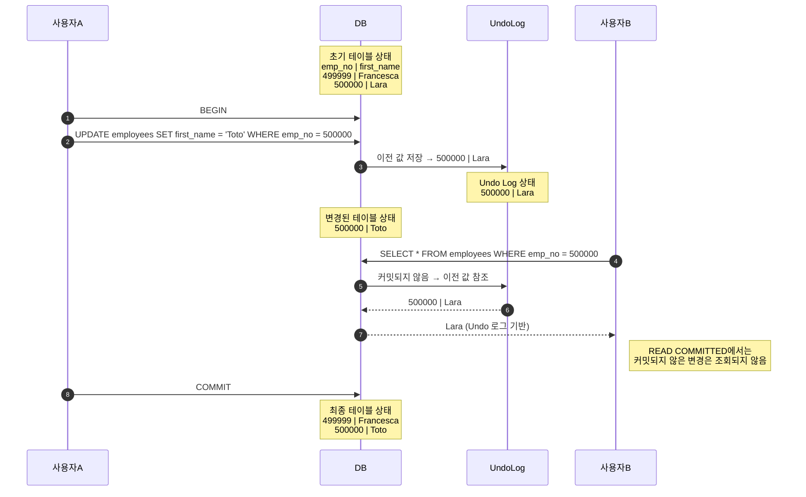
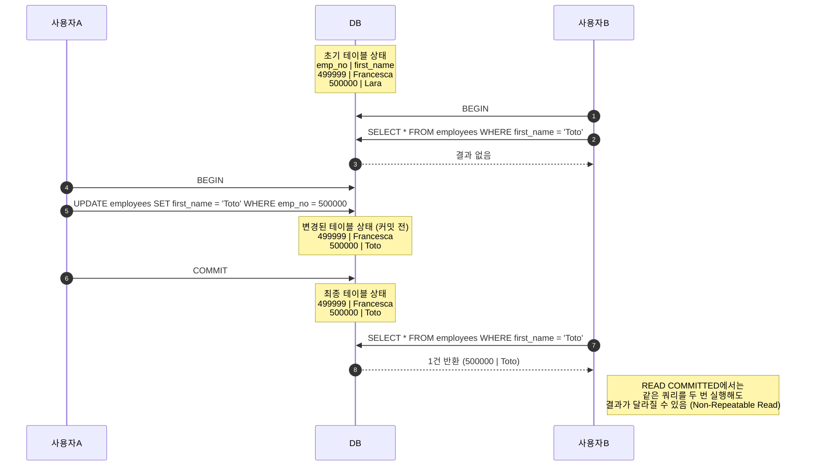
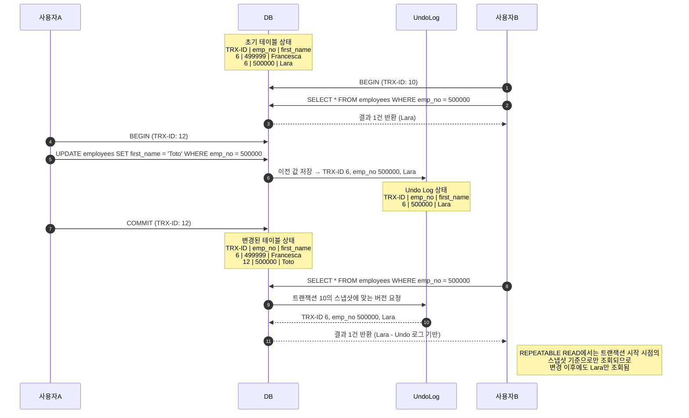
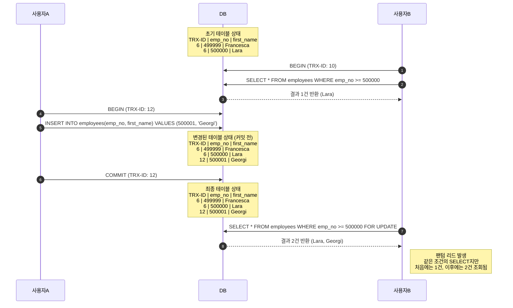

# MySQL의 격리 수준

트랜잭션의 격리 수준(isolation level)이란 여러 트랜잭션이 동시에 처리될 때 특정 트랜잭션이 다른 트랜잭션에서 변경하거나 조회하는 데이터를 볼 수 있게 허용하맂 말지를 결정하는 것.
  
### 사전 지식
- MVCC(Multi Version Concurrency Control)
  - 잠금을 사용하지 않는 일관된 읽기를 제공하는 목적.
    - InnoDB는 언두 로그를 이용해 이 기능을 구현한다.
    - 순수한 읽기 작업은 잠금을 기다리지 않고 읽기 작업이 가능하다.(SERIALIZABLE 제외)
  - 멀티 버전이라 함은 하나의 레코드에 대해 여러 개의 버전이 동시에 관리된다는 의미.
  - 하나의 레코드에 대해 여러개의 버전이 유지되고 필요에 따라 어느 데이터가 보여지는지 달라지는 구조.
- 갭 락
  - 레코드 자체가 아니라 레코드 사이의 간격만을 잠그는 것을 의미
  - 넥스트 키 락의 일부로 자주 사용됨
- 넥스트 키 락
  - 레코드 락과 갭 락을 합쳐 놓은 형태의 잠금
  - REPEATABLE READ 격리수준에서 사용됨
- 인덱스와 잠금
  - InnoDB의 잠금은 레코드를 잠그는 것이 아니라 인덱스를 잠그는 방식으로 처리됨
    - 프라이머리 키 또는 유니크 인덱스에 의한 변경 작업은 갭 락이 걸리지 않고 레코드 자체에만 락이 걸림
    - 적절한 인덱스 조회가 중요한 이유
    - 인덱스가 하나도 없다면 테이블의 조회 과정의 모든 레코드를 잠구게 됨

## 종류 (격리 정도가 높아지는 순으로 나열)

1. READ UNCOMMITTED(DIRTY READ)
2. READ COMMITTED
3. REPEATABLE READ
4. SERIALIZABLE

SERIALIZABLE 격리 수준이 아니라면 크게 성능의 개선이나 저하는 발생하지 않음.
  

## 대표적인 세 가지 부정합의 문제점

1. DIRTY READ 
   - READ UNCOMMITTED
2. NON-REPEATABLE READ 
   - READ UNCOMMITTED
   - READ COMMITTED
3. PHANTOM READ 
   - READ UNCOMMITTED
   - READ COMMITTED
   - REPEATABLE READ(INNODB 는 문제 없음)

InnoDB에서는 독특한 특성 때문에 REPEATABLE READ 격리 수준에서도 PHANTOM READ가 발생하지 않는다.
  

### READ UNCOMMITTED (DIRTY READ 발생)

사용자 A가 새로운 사원을 INSERT 하는데 사용자 B가 커밋하기 전에 해당 조건의 사원을 조회할 수 있다.
만약 사용자 A가 처리 도중 문제가 발생해 롤백한다고 해도 사용자 B는 조회한 내용으로 처리를 계속 하는 문제가 발생한다.
이러한 어떤 트랜잭션에서 처리한 작업이 완료되지 않았는데도 다른 트랜잭션에서 볼 수 있는 현상을 더티 리드라고 하고, 더티 리드가 허용되는 격리 수준은 READ UNCOMMITTED밖에 없다.
이런 이유로 MySQL을 사용한다면 최소한 READ COMMITTED 이상의 격리 수준을 사용할 것을 권장한다.
  

### READ COMMITTED

사용자 A가 커밋을 수행하기 전에 사용자 B가 같은 레코드의 사원을 조회하면 언두 영역에 백업된 레코드에서 결과를 가져온다.
 READ COMMITTED 격리 수준에서도 NON-REPEATABLE READ라는 부정합의 문제가 있다.
  

### NON-REPEATABLE READ 발생

위의 예시를 보면 사용자 B가 하나의 트랜잭션에서 똑같은 SELECT 쿼리를 실행했을 때 항상 같은 결과를 가져와야 한다는 REPEATABLE READ 정합성에 어긋난다. 즉 NON-REPEATABLE READ 문제가 발생한다.
  
REPEATABLE READ 가 보장되지 않으면 다른 트랜잭션에서 입금과 출금 처리가 계속 진행될 때 다른 트랜잭션에서 오늘 입금된 금액의 총합을 조회해서 사용해야 할 경우 총합을 조회하는 SELECT 쿼리가 실행될 때마다 다른 결과를 가져올 것이다.
  

### REPEATABLE READ

MySQL의 InnoDB 스토리지 엔진에서 기본으로 사용되는 격리 수준.
READ COMMITTED 와 다른 점은 사용자B가 SELECT를 하기 전 트랜잭션을 시작하면서 10번이라는 트랜잭션의 번호를 부여받아 사용자B의 10번 트랜잭션 안에서 실행되는
모든 SELECT 쿼리는 트랜잭션 번호가 10(자신의 트랜잭션 번호) 보다 작은 트랜잭션 번호에서 변경한 것만 보게 된다.
그래서 트랜잭션 범위가 길어질수록 언두에 백업된 레코드가 많아져 MySQL 서버의 처리 성능이 떨어질 수 있다.
  

### PHANTOM READ(PHANTOM ROWS) 발생 (INNODB 는 문제 없음)

REPEATABLE READ 격리 레벨에서도 위와같이 하나의 트랜잭션에서 SELECT의 결과가 다른 경우가 존재하는데, 이렇게 다른 트랜잭션에서 수행한 변경 작업에 의해 레코드가 보였다 안보였다 하는 현상을 PHANTOM READ 라고 한다.
이런 잠금을 동반한 SELECT 쿼리는 레코드에 쓰기 잠금을 걸어야 하는데 언두 레코드에는 잠금을 걸 수 없어서 현재 레코드의 값을 가져오게 된다.
InnoDB 스토리지 엔진에서는 갭 락과 넥스트 키 락 덕분에 REPEATABLE READ 격리 수준에서도 이미 PHANTOM READ가 발생하지 않기 때문에 굳이 SERIALIZABLE을 사용할 필요가 없다.
